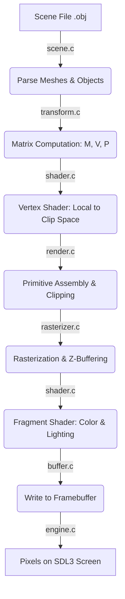

> [!WARNING]
> This project is still under development and may have some bugs.

# Software 3D Renderer

## Overview
This project is a lightweight, CPU-based 3D rendering engine written from scratch in C. It performs all 3D mathematics, vertex transformations, polygon clipping, and pixel rasterization natively, relying on the SDL3 library solely to create a window and display the final pixel buffer on the screen.

## Key Features
* Built-in Mathematics: Custom implementations of 3D vectors, 4x4 matrices, and standard geometric transformations (Model, View-LookAt, and Perspective Projection).
* Rendering Pipeline: Complete implementation of vertex processing, near-plane clipping (capable of dynamic triangle generation), and frustum culling to prevent rendering off-screen geometry.
* Rasterization: Uses barycentric coordinates for triangle rasterization alongside a dedicated Z-buffer for accurate depth testing and backface culling.
* Shading Support: Includes Vertex and Fragment shaders supporting both Flat Shading (uniform face colors based on directional light) and Gouraud Shading (smooth interpolation of vertex normals and lighting).
* Scene Parsing: Implements a custom text-based scene file parser to easily load geometry, object transforms, per-vertex colors, and camera settings.

## System Architecture
The engine is highly modular, split into focused C files:
* Engine Context (`engine.c`, `buffer.c`): Manages the SDL3 window, renderer, and the memory structures for the screen's pixel array and Z-buffer.
* Core Pipeline (`render.c`, `rasterizer.c`): Orchestrates the render loop. It transforms vertices from local to clip space, clips geometry against the camera bounds, and passes the output to the rasterizer for pixel plotting.
* Shaders (`shader.c`): Separates the logic for lighting calculations and vertex color application.
* Transform & Math (`transform.c`, `matrix.h`, `vector.h`): Handles all linear algebra, including vector dot/cross products, matrix multiplication, and normal matrix calculation (inverse transpose).
* Scene I/O (`scene.c`): Reads custom scene `.obj` files, safely parsing data with validated file reading checks, and automatically computing face and vertex normals.

## Rendering Pipeline

## Scene Configuration Format
The project uses a custom, easy-to-read text format for loading 3D environments. A typical file includes:
1. Header: Defines the total number of unique meshes and spawned objects.
2. Meshes: Lists the 3D vertex coordinates and the face indices that connect them.
3. Objects: Spawns an instance of a mesh, assigning its local position, rotation, scale, and an array of specific RGB colors for its vertices.
4. Camera: Defines the camera's spatial position, its target look-at coordinate, a global 'up' vector, and the Y-axis Field of View (FOV).

## Dependencies
* A standard C Compiler (GCC, Clang, or MSVC)
* SDL3 (Simple DirectMedia Layer v3)
